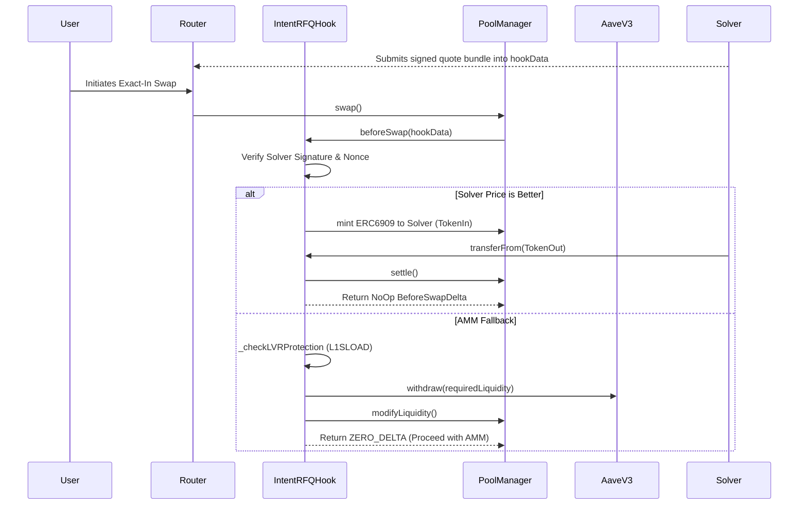

# ⚡ IntentRFQ - Uniswap V4 Intent-Based RFQ Hook

A highly optimized, synchronous Request-For-Quote (RFQ) smart contract hook for Uniswap V4. `IntentRFQ` bridges off-chain solvers with on-chain liquidity to guarantee zero-slippage trades, while simultaneously maximizing LP yield through Aave V3 idle liquidity lending and protecting against toxic arbitrage via `L1SLOAD` LVR defense.

## 🌟 Key Features

### 1. Direct Solver Settlement (Zero Slippage)
Intersects users' swaps via the `beforeSwap` callback. If a trusted off-chain solver can offer a better price than the AMM, the hook intercepts the flow. Using V4's `BeforeSwapDelta` NoOp flags and `ERC6909` minting, it completely bypasses the AMM math and settles the trade directly between the user and the solver at an exact, zero-slippage price.

### 2. Synthetic Idle Liquidity Sweeping
If solvers handle the majority of trading volume, AMM liquidity sits idle. `IntentRFQ` solves this by permissionlessly sweeping idle AMM capital into **Aave V3** to generate continuous interest for LPs. 

### 3. Just-In-Time (JIT) Clawback
If the solver network fails to quote a trade and it falls back to the AMM, the hook dynamically calculates the exact liquidity required. It performs a synchronous JIT withdrawal from Aave and re-injects it into the V4 PoolManager seamlessly to execute the trade.

### 4. L1SLOAD LVR Protection
Built for L2s like Scroll, the hook uses the `L1SLOAD` precompile to synchronously read the exact Ethereum Mainnet (Layer 1) Uniswap V3 `Slot0` price. If the L2 price deviates by > 0.5% from the L1 price, the hook detects impending toxic arbitrage and reverts the transaction, virtually eliminating Loss Versus Rebalancing (LVR) for LPs.

---

## 🛠 Architecture & Flow



---

## 🚀 Getting Started

### Prerequisites
- [Foundry](https://getfoundry.sh/)
- [Python 3.10+](https://www.python.org/downloads/) (for the solver mock)

### 1. Build the Contracts
```bash
forge install
forge build
```

### 2. Run the Fuzz Tests
The project features a rigorous fuzz-testing suite to mathematically guarantee signature security and protect against replay attacks.
```bash
forge test -vvv
```

### 3. Gas Profiling
Run a gas report to view the execution costs. Note: The codebase includes to-do optimizations for replacing OpenZeppelin ECDSA with raw inline assembly `ecrecover`.
```bash
forge test --gas-report
```

### 4. Run the Solver Mock
To see how the off-chain solver monitors intents, formats execution payloads, and injects signatures, explore the mock script:
```bash
pip install eth-account web3
python solver_mock.py
```

### 5. Deployment
In Uniswap V4, hook permissions are encoded into the contract's Ethereum address. You cannot deploy the hook using standard `CREATE`. We use `HookMiner` to brute-force a deployment salt.

Configure your environment:
```bash
export PRIVATE_KEY="your_private_key"
export POOL_MANAGER="0x..."
export AAVE_V3_POOL="0x..."
export L1_POOL="0x..."
```

Deploy:
```bash
forge script script/DeployHook.s.sol --rpc-url <YOUR_RPC_URL> --broadcast
```

---

## 📖 Roadmap (v2.0)
- **ERC-7683 Integration**: Replace the proprietary `SolverQuote` struct with the native ERC-7683 `CrossChainOrder` standard to tap into global intent networks like UniswapX and Across.
- **Inline Assembly ECDSA**: Strip high-level cryptography dependencies for hyper-optimized gas consumption on the hot path.

## 📜 License
MIT
