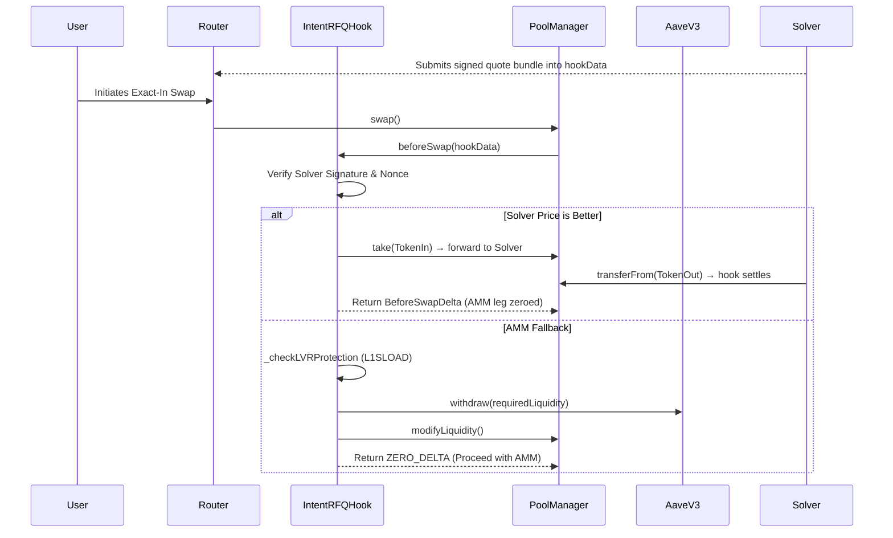

# ⚡ IntentRFQ - Uniswap V4 Intent-Based RFQ Hook

A highly optimized, synchronous Request-For-Quote (RFQ) smart contract hook for Uniswap V4. `IntentRFQ` bridges off-chain solvers with on-chain liquidity to guarantee zero-slippage trades, while simultaneously maximizing LP yield through Aave V3 idle liquidity lending and protecting against toxic arbitrage via `L1SLOAD` LVR defense.

## 🌟 Key Features

### 1. Direct Solver Settlement (Zero Slippage)
Intersects users' swaps via the `beforeSwap` callback. If a trusted off-chain solver can offer a better price than the AMM, the hook takes over the swap entirely: the returned `BeforeSwapDelta` zeroes out the AMM leg while encoding the hook's obligation, the hook forwards the user's input tokens to the solver via `take`, and pulls the solver's output tokens via `transferFrom` to settle. The user receives exactly the quoted amount with zero slippage.

### 2. Synthetic Idle Liquidity Sweeping
If solvers handle the majority of trading volume, AMM liquidity sits idle. `IntentRFQ` solves this by permissionlessly sweeping idle AMM capital into **Aave V3** to generate continuous interest for LPs. 

### 3. Just-In-Time (JIT) Clawback
If the solver network fails to quote a trade and it falls back to the AMM, the hook dynamically calculates the exact liquidity required. It performs a synchronous JIT withdrawal from Aave and re-injects it into the V4 PoolManager seamlessly to execute the trade.

### 4. L1SLOAD LVR Protection (Scaffold)
Built for L2s like Scroll, the hook is designed to use the `L1SLOAD` precompile to synchronously read the Ethereum Mainnet (Layer 1) Uniswap V3 `Slot0` price. If the L2 price deviates by > 0.5% from the L1 price, the hook detects impending toxic arbitrage and reverts the transaction. **Status: the check scaffolding and threshold logic are implemented, but the L1 price read itself is currently a placeholder** — on chains without the precompile the check is skipped. See the roadmap for the production implementation.

---

## 🛠 Architecture & Flow



---

## 🚀 Getting Started

### Prerequisites
- [Foundry](https://getfoundry.sh/)
- [Python 3.10+](https://www.python.org/downloads/) (for the solver mock)

### 1. Build the Contracts
```bash
forge install
forge build
```

### 2. Run the Fuzz Tests
The project features a rigorous fuzz-testing suite to mathematically guarantee signature security and protect against replay attacks.
```bash
forge test -vvv
```

### 3. Gas Profiling
Run a gas report to view the execution costs. Note: The codebase includes to-do optimizations for replacing OpenZeppelin ECDSA with raw inline assembly `ecrecover`.
```bash
forge test --gas-report
```

### 4. Run the Solver Mock
To see how the off-chain solver monitors intents, formats execution payloads, and injects signatures, explore the mock script:
```bash
pip install eth-account web3
python solver_mock.py
```

### 5. Deployment
In Uniswap V4, hook permissions are encoded into the contract's Ethereum address. You cannot deploy the hook using standard `CREATE`. We use `HookMiner` to brute-force a deployment salt.

Configure your environment:
```bash
export PRIVATE_KEY="your_private_key"
export POOL_MANAGER="0x..."
export AAVE_V3_POOL="0x..."
export L1_POOL="0x..."
```

Deploy:
```bash
forge script script/DeployHook.s.sol --rpc-url <YOUR_RPC_URL> --broadcast
```

---

## 🚀 Potential Additional Features (Roadmap)

While the core protocol is functional and covered by Foundry tests (including an end-to-end solver-fill test), there are several advanced architectural upgrades that would take this hook to the next level:

- **Production L1SLOAD LVR check**: replace the placeholder precompile call with a real L1 `Slot0` read on Scroll (or a fallback oracle) so the LVR circuit breaker is live rather than scaffolding.
- **EIP-712 Typed Data Signatures**: Transition from raw `keccak256` hashing to EIP-712 structured data signing. This will make solver quotes fully transparent on block explorers and instantly compatible with established professional market-maker tooling.
- **Yield Harvesting & LP Distribution**: Add a `harvestYield()` mechanism to explicitly claim the accrued Aave interest (where `aToken balance > principalAMM`) and auto-compound it into the pool as protocol-owned liquidity, or distribute it directly to LPs.
- **Partial Fills & Hybrid AMM Routing**: Upgrade the `beforeSwap` logic to accept an array of quotes, allowing a solver to partially fill a massive trade at zero-slippage, while using `BeforeSwapDelta` to seamlessly route the remaining percentage to the standard AMM curve.
- **Dynamic LVR Thresholds**: Instead of a hardcoded `0.5%` LVR threshold, dynamically adjust the allowable L1 vs. L2 price deviation based on real-time block-to-block implied volatility, preventing the pool from freezing during extreme organic market events.
- **Slippage Handling**: Improve the theoretical AMM spot price check to account for dynamic order sizing and depth-of-book slippage, ensuring solvers are forced to compete against the *true* AMM execution price rather than the static spot price.
- **Aave 100% Utilization Graceful Degradation (Idle Buffers)**: Currently, if Aave hits 100% utilization, the JIT withdrawal reverts and fails the user's swap. Implement a native "Idle Buffer" (keeping 5-10% of TVL in the `PoolManager`) and `try/catch` fallback logic to prevent transient DeFi yield failures from bricking DEX trade execution.
- **Yul / Inline Assembly Cryptography**: Rewrite the ABI decoding and signature recovery on the "hot path" entirely in Yul using the `0x01` `ecrecover` precompile. Stripping the OpenZeppelin Solidity overhead could save ~12,000 gas per trade.
- **ERC-7683 Cross-Chain Intent Standardization**: Replace the proprietary `SolverQuote` struct with the native ERC-7683 `CrossChainOrder` standard to instantly plug the hook into global intent networks like UniswapX and Across Protocol.

## 📜 License
MIT
