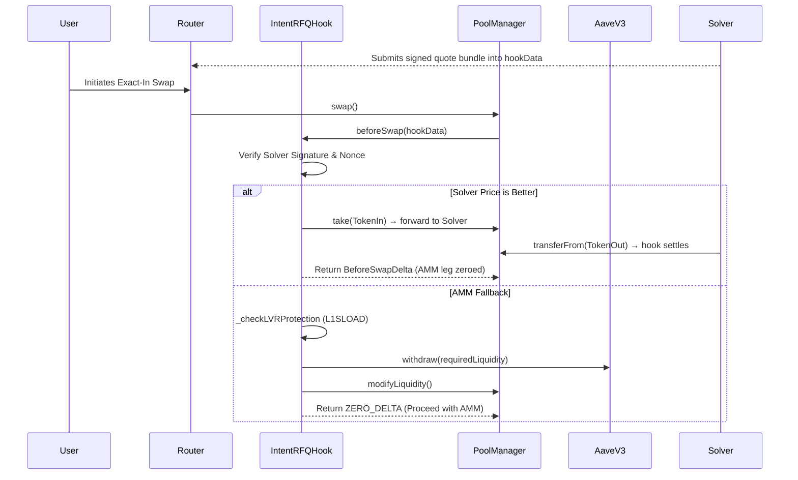

# IntentRFQ — zero-slippage RFQ settlement as a Uniswap v4 hook

A Uniswap v4 hook that lets off-chain solvers fill swaps at exactly their quoted price — **zero slippage for the user** — while idle AMM liquidity earns yield in Aave instead of sitting still.

**Status:** 18/18 Foundry tests passing (unit, fuzz, end-to-end) · **Live on Base Sepolia** — [hook](https://sepolia.basescan.org/address/0xD42e09EF622a4583E7Dd72c1881Ab7E3Fb3Bc088) · [pool](https://sepolia.basescan.org/address/0xD42e09EF622a4583E7Dd72c1881Ab7E3Fb3Bc088)

## How it works

Every swap passes through the hook's `beforeSwap`. Two paths:

**1. Solver fill (the interesting path).** The swapper attaches a solver-signed quote to `hookData`. If the quote is fresh, signed by an authorized solver, bound to this pool and direction, and beats the AMM spot price, the hook takes over the swap entirely: it zeroes out the AMM leg via `BeforeSwapDelta`, claims the user's input tokens with `take` and forwards them to the solver, then pulls the solver's output tokens with `transferFrom` and settles. The user gets exactly the quoted amount.

**2. AMM fallback.** If there is no quote — or the quote is stale, invalid, or uncompetitive — the swap executes against the AMM as normal. Before it does, the hook JIT-withdraws the swap's *output* token from Aave and adds it as single-sided liquidity just ahead of the price direction, deepening the reserves the swap traverses. Idle hook-owned liquidity can be swept back into Aave permissionlessly at any time.



A fourth piece, **L1SLOAD LVR protection**, is scaffolded: on L2s like Scroll the hook is designed to read the L1 Uniswap `Slot0` via the L1SLOAD precompile and revert the swap if the L2 price deviates more than ~0.5% (toxic arbitrage in progress). The threshold logic is implemented; the precompile read itself is a placeholder and the check is skipped on chains without it.

## Engineering notes

The decisions that shaped this code, and the bugs they caught:

- **v4 transient accounting is unforgiving.** The first solver-takeover implementation had the wrong sign on the specified delta (which *doubled* the AMM swap instead of cancelling it) and minted ERC6909 claims instead of `take`ing, leaving an unsettled debit. Fixed against the v4-core source and locked in with an end-to-end test asserting exact user/solver balances.
- **Ordering is a correctness property.** In the settlement flow, `sync()` must precede the token transfer or `settle()` measures a zero delta and the whole unlock reverts with `CurrencyNotSettled`.
- **Never brick the user's swap.** Stale, expired, or uncompetitive quotes fall back to AMM execution instead of reverting. The JIT clawback is best-effort for the same reason.
- **The testnet caught what unit tests didn't.** `sweepIdleLiquidity` called `modifyLiquidity`/`take` outside an `unlock` context, so it could never execute as a standalone transaction — found during the Base Sepolia deployment, fixed via `unlockCallback`, covered by a new regression test.
- **Quotes are bound to pool + direction.** The signed message commits to `poolId` and `zeroForOne`, so a quote can't be replayed on another pool or flipped.

## Run it

```bash
forge build
forge test            # 18/18: unit, fuzz, end-to-end solver fill
```

Deploy to a v4 testnet (hook address is mined with `HookMiner` to satisfy the permission flags):

```bash
export DEPLOYER_KEY=<key> SOLVER_KEY=<key> POOL_MANAGER=<v4_pool_manager>
forge script script/TestnetDeploy.s.sol --tc TestnetDeploy --rpc-url <RPC> --broadcast
```

Verify end-to-end on-chain (solver fill → AMM fallback + JIT → sweep):

```bash
export DEPLOYMENT_FILE=deployments/base-sepolia.json
forge script script/TestnetVerify.s.sol --tc TestnetVerify --rpc-url <RPC> --broadcast
```

`solver_mock.py` shows the off-chain side: how a solver formats and signs quotes.

## Live deployment (Base Sepolia)

| Contract | Address |
|---|---|
| IntentRFQHook | [`0xD42e09EF622a4583E7Dd72c1881Ab7E3Fb3Bc088`](https://sepolia.basescan.org/address/0xD42e09EF622a4583E7Dd72c1881Ab7E3Fb3Bc088) |
| Pool ID (TTA/TTB, 0.3%, hook above) | `0x651ff4994d57bd091370bbf2ba1ea198c4d911703c50639cc7b5c7229056b57a` |
| Mock Aave V3 pool | [`0x27138647be3c1A5bB888ad9e046CB5C38868e1a9`](https://sepolia.basescan.org/address/0x27138647be3c1A5bB888ad9e046CB5C38868e1a9) |
| v4 PoolManager (canonical) | [`0x05E73354cFDd6745C338b50BcFDfA3Aa6fA03408`](https://sepolia.basescan.org/address/0x05E73354cFDd6745C338b50BcFDfA3Aa6fA03408) |

## Roadmap

- **Production L1SLOAD LVR check** — real L1 `Slot0` read on Scroll (or fallback oracle) so the circuit breaker is live, not scaffolding.
- **Slippage-aware quote comparison** — compare against true AMM execution price (depth + fees), not marginal spot.
- **Aave utilization handling** — idle buffer + `try/catch` so 100% utilization degrades gracefully instead of bricking swaps.
- **EIP-712 quotes** — structured signing for explorer transparency and market-maker tooling compat.
- **Partial fills / hybrid routing** — one swap split across solver quotes and the AMM curve via `BeforeSwapDelta`.
- **Gas** — raw `ecrecover` on the hot path (~12k gas/trade); the OZ overhead is documented in-code.

## License
MIT
